# my-portefolio (Vue3)

## Demo

TBD

## Project setup

### Git clone

```
git clone project-link
```

> Some files may be case sensitive and get renamed by operating system, after clonning. Running the app will then return "Module not found" Error. 

### Software Requirement 
```
npm install
```

### prepare .env file configuration

Rename example.env to .env, at the project root: same directory than this README.md.

The structure is the following one. Through this configuration tutorial, you will get every of those informations.Ò
```
VUE_APP_API_KEY=
VUE_APP_AUTH_DOMAIN=
VUE_APP_PROJECT_ID=
VUE_APP_STORAGE_BUCKET=
VUE_APP_MESSAGING_SENDER_ID=
VUE_APP_APP_ID=
VUE_APP_DATABASE_URL=
VUE_APP_EMAILJS_SERVICE_ID=
VUE_APP_EMAILJS_TEMPLATE_ID=
VUE_APP_EMAILJS_USER_ID=
VUE_APP_RECAPTCHA_V3_PUBLIC_KEY=
VUE_APP_CV_LINK=
```

#### Compiles and hot-reloads for development

```
npm run serve
```

### Create a Firebase project

Go to [Firebase website](https://firebase.google.com/)

Make sure to get connected with your Google account.
___
Click on "Get Start" or "Go to console" in top right corner:

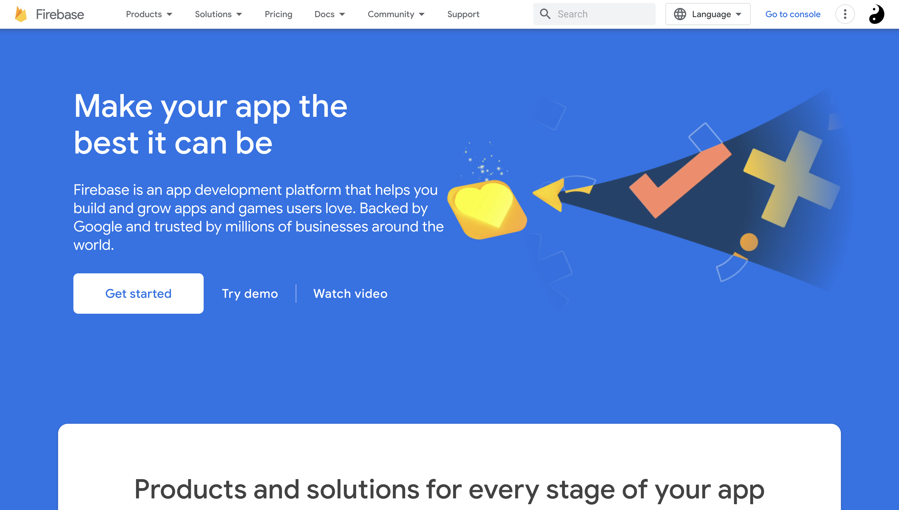

Click on "+ Add project" to define a new firebase application project by following few steps.

___  
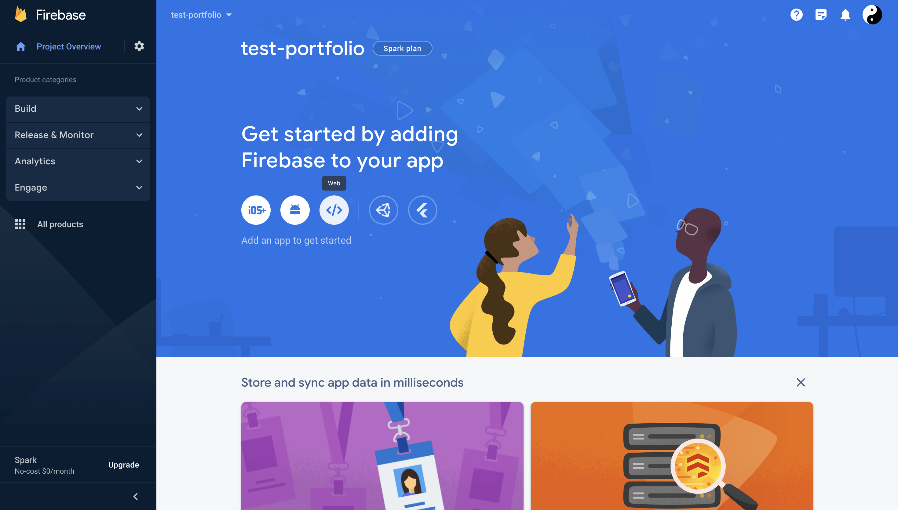
Then, choose to set a web app up and choose an app name. Do not select a Firebase hosting yet.

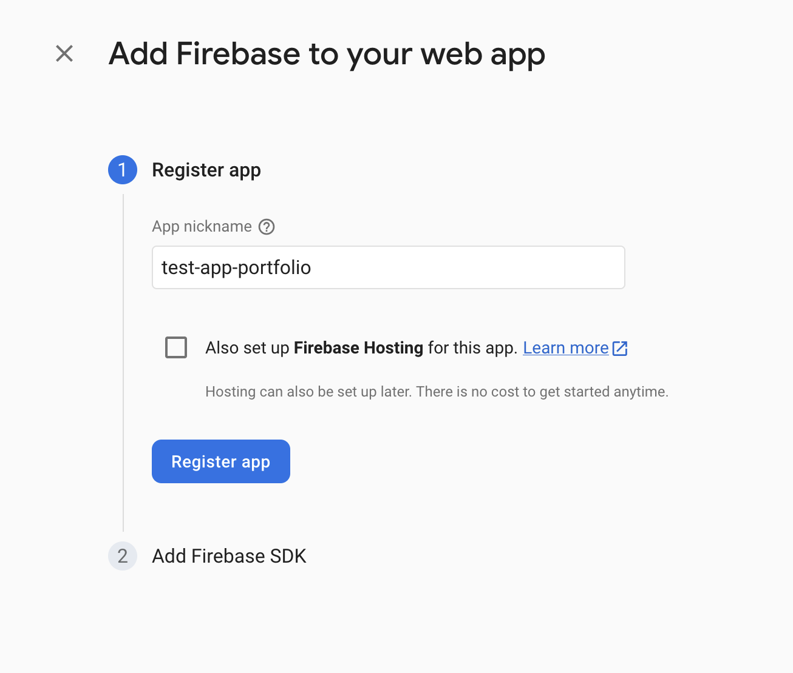

Then you will get a piece of code with initialization information. Set the following one inside the .env file:

```
VUE_APP_API_KEY=your_apiKey
VUE_APP_AUTH_DOMAIN=your_authDomain
VUE_APP_PROJECT_ID=your_projectId
VUE_APP_STORAGE_BUCKET=your_storageBucket
VUE_APP_MESSAGING_SENDER_ID=uour_messagingSenderId
VUE_APP_APP_ID=your_appId
```
Finally, click to "go to console".
___

> You can configure your own domains. After deploying the app, you should be able to access it throught the defaults project domains

### Firebase authentication

Go to Firebase authentication menu and click "Get Started".

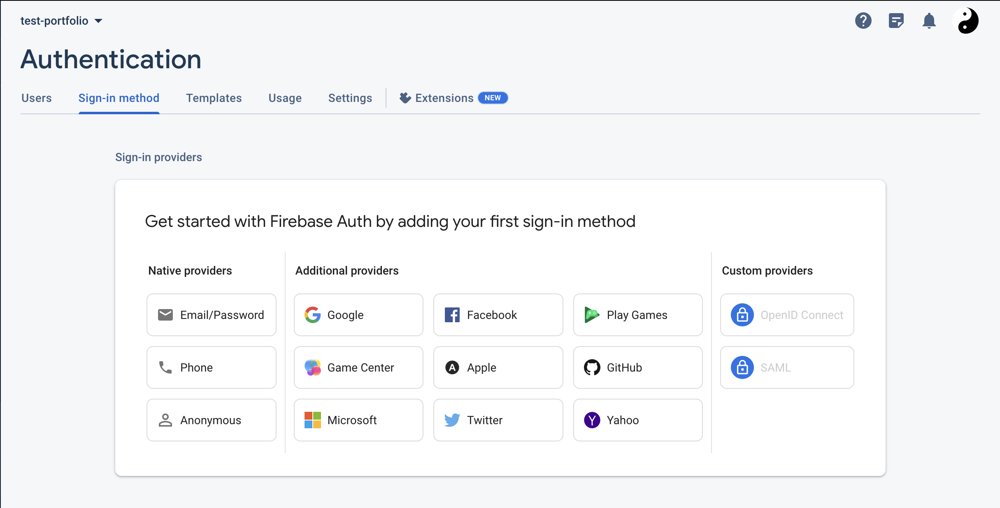

Choose the email/password sign in method.

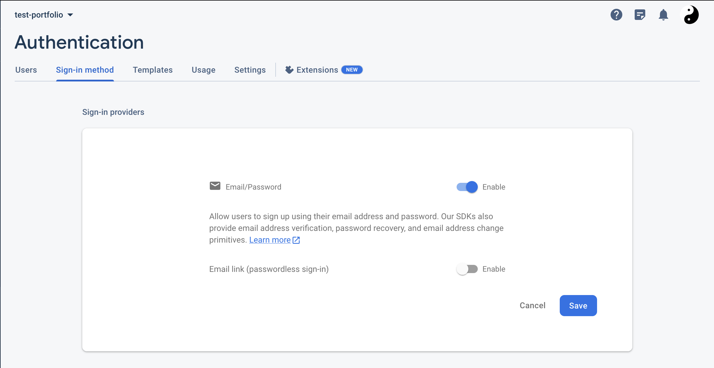

Enable Email/password and let Email link disabled. Save.

___

Go to Authentication/users submenu in order to create your admin user:

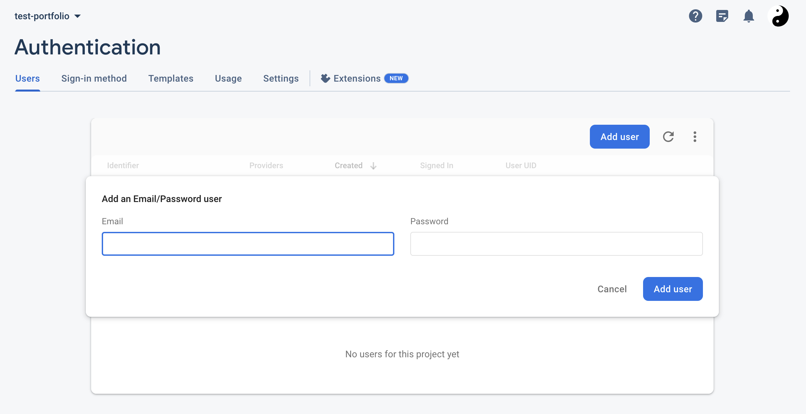


### realtime database configuration

Go to Firebase Realtime Database menu and click "Create Database".

1. choose locked mode

2. Go to "Rules" submenu and paste following rules:

```
{
  "rules": {
    "pages": {
      ".read": true,
      ".write": "auth.uid == 'your_admin_user_uid'"
    }
  }
}
```

> You can get your user UID in the Authentication menu (check Authentication part above)

___

3. Then get the content from import-me.json in project's root to get the database structure. Import JSON file from "..." options of the menu. 

<!-- 5. Go to AppCheck menu (if configured). Enforce the Realtime database. -->

6. From the data submenu of the realtime database menu, you should see a URL above the JSON section.  It typically looks something like: https://<your-project-id>.firebaseio.com
'''
VUE_APP_DATABASE_URL=your_url
'''

### Firebase storage configuration (for files storage)

Go to Firebase Storage menu and click "Get Started".

1. choose production mode

2. choose your storage location (cannot be changed anymore, in case of error, recreate a project)

> After you set this location, you cannot change it later. This location setting will also be the default location for Cloud Firestore. 

3. Click "Done"

<!-- 4. Go to AppCheck menu (if configured). Enforce the storage -->

4. Go to Firebase Storage / Rules. Edit rules so the read and write is possible (true):
```
rules_version = '2';

// Craft rules based on data in your Firestore database
// allow write: if firestore.get(
//    /databases/(default)/documents/users/$(request.auth.uid)).data.isAdmin;
service firebase.storage {
  match /b/{bucket}/o {
    match /{allPaths=**} {
      allow read, write: if true;
    }
  }
}
```
> Make sure the value stay 'true'.

___

5. Once the storage is initiated, create the 2 following directories:

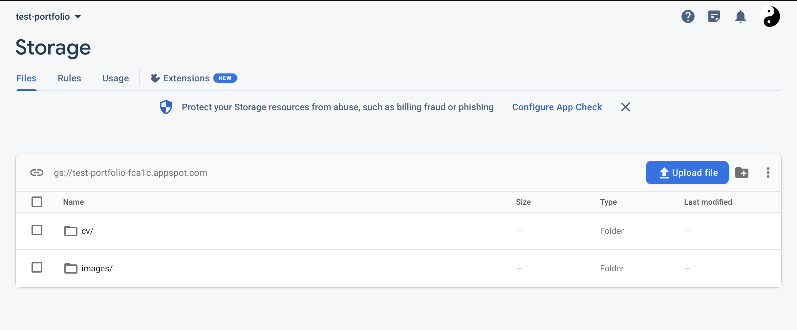

### EmailJS configuration

Go to [EmailJS website](https://www.emailjs.com). 

1. Sign in or create an account.

2.Add a new service

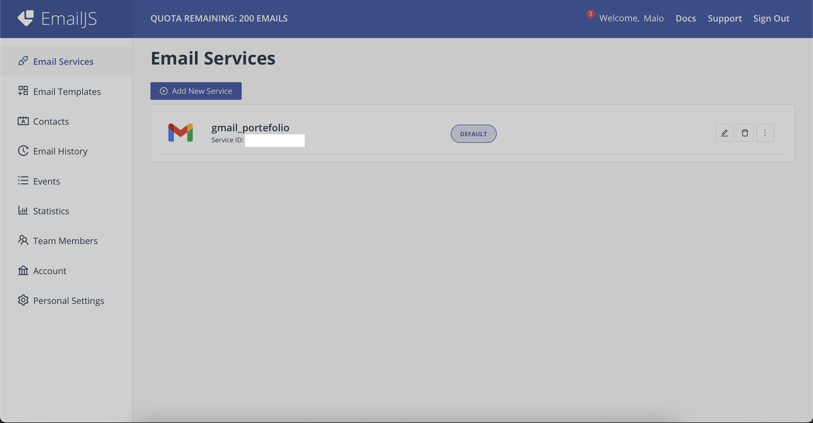

3. Choose one service (Gmail here)

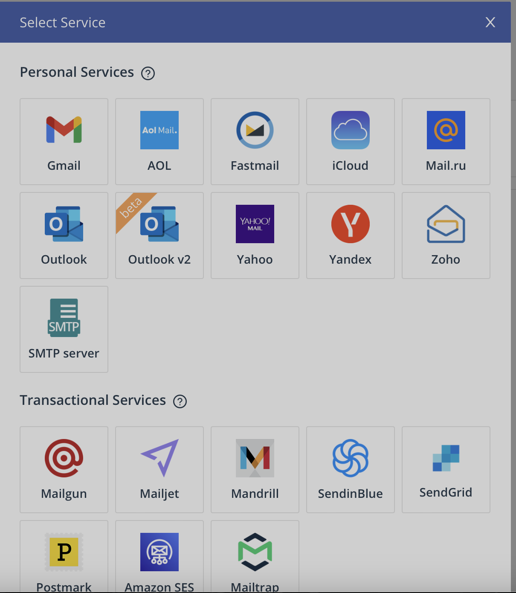

4. Choose a service name, connect your Google account and click "Create service"

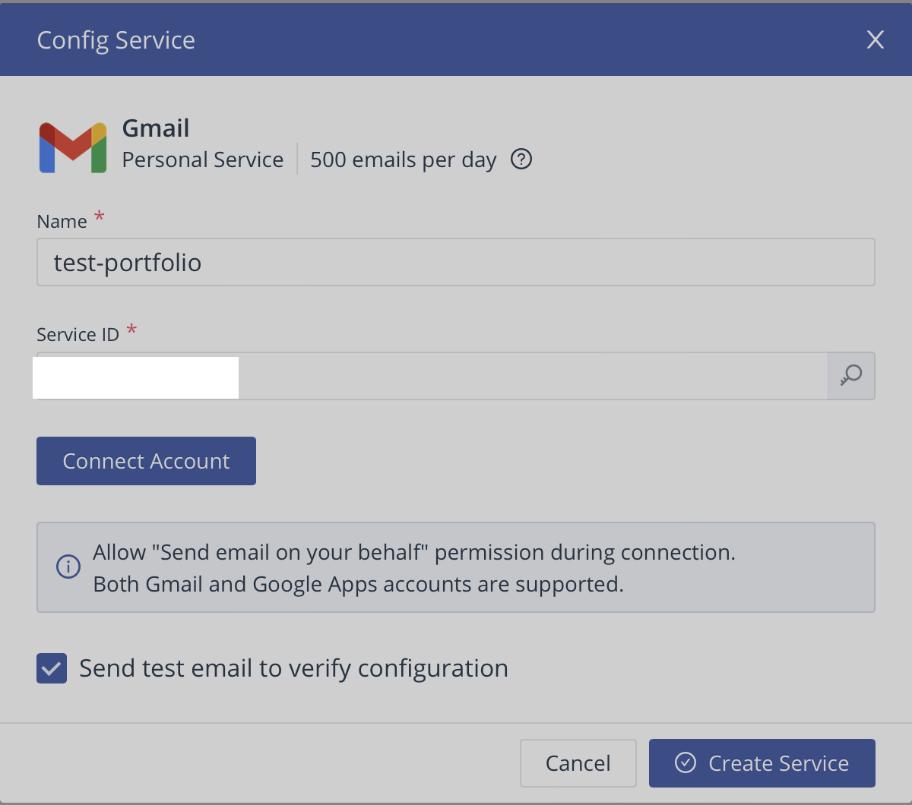

5. Create an email template using following docs:
- [Creating email templates](https://www.emailjs.com/docs/user-guide/creating-email-templates/)
- [React: Send email from contact form without server code](https://www.youtube.com/watch?v=bMq2riFCF90)

Once EmailJS is configured, you should get the 3 following IDs inside the .env file:
```
VUE_APP_EMAILJS_SERVICE_ID=your_service_id
VUE_APP_EMAILJS_TEMPLATE_ID=your_template_id 
VUE_APP_EMAILJS_USER_ID=your_user_id     
```
### CV upload

You can make a CV downloadable. 

Just follow the following steps:

1. get your CV prepared

2. Go to Firebase Storage: cv / 

3. Upload your file to cv/ directory 

3. Alternatively, you can upload your PDF CV from the admin pannel of the app (when deployed)

4. Once file is uploaded, get the generated file url from the file description and paste it inside the .env file:
```
VUE_APP_CV_LINK=your_firebase_stroage_uploaded_cv_url
```

### Firebase project hosting

Once every above parts are correctly configured, you can deploy the app with the following steps.
Your .env file should be full.

#### Hosting

Go to Firebase Hosting menu and click "Get Started".

1. Run those commands from your app's root directory: 

```
npm install -g firebase-tools
```

2. Sign in to Google 
```
firebase login
```

3. Initiate your project 
```
firebase init
```

4. App build

```
npm run build
```

5. Deploy
```
firebase deploy
```

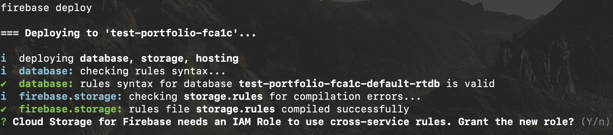

> During deploy, Firebase CLI may ask you a question about IAM Role, answer by no or by yes if you know what you are doing. 

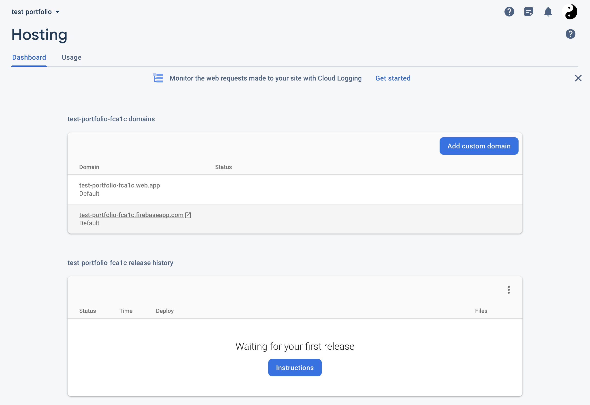

> If deploy is succesfull, you should see a production version of your app currently working and accessible from the displayed URLs


## Going further

> This part is case sensitive and you should own a proper domain name

### Associate app to a owned domain name

Go to Firebase Hosting menu and click "Add custom domain". A new menu appears:


Then write your domain.

You can follow this documentation to go through this step:
- [[Official documentation] Connect a custom domain](https://firebase.google.com/docs/hosting/custom-domain?hl=fr)
- [[Tutorial] - How to Setup Custom Domain for Google Firebase Website](https://www.youtube.com/watch?v=IBMNvoJcy-k)

### App check activation

Go to Firebase AppCheck menu and click "Get Started".

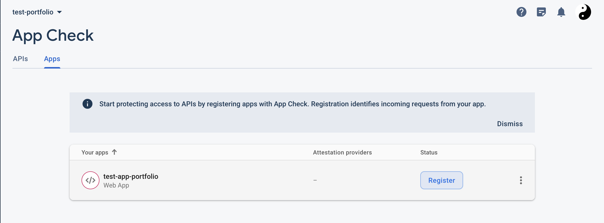

Click "Register" then "ReCAPTCHA".

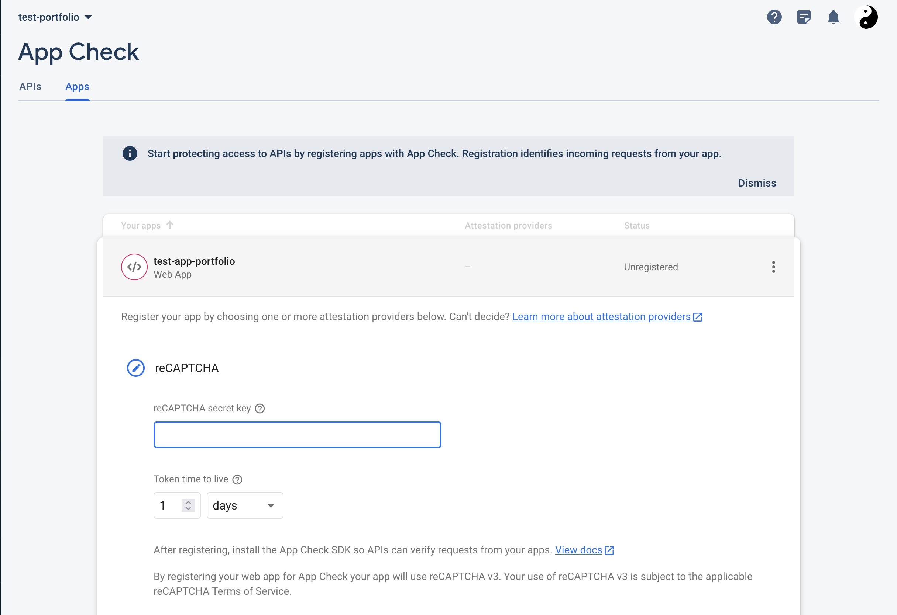

Then go to [ReCAPTCHA creatio site](https://www.google.com/recaptcha/admin/create) in order to allow ReCAPTCHA onto your domain.

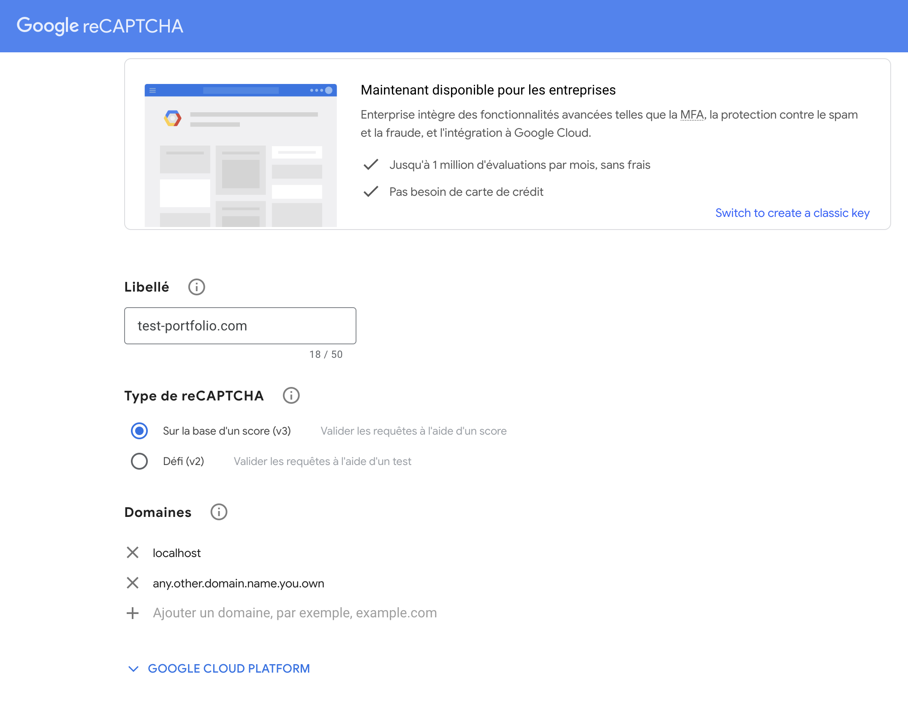

Finally, click "Send" and get generated public and private key.

- save the secret key in the firebase appcheck configuration:

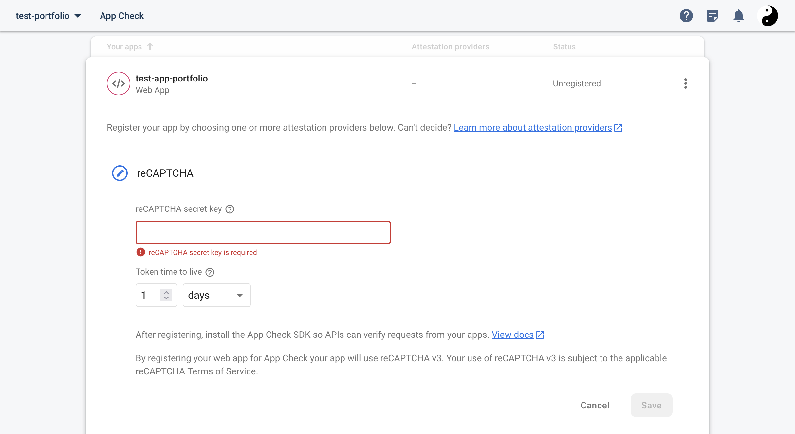

- save the public key inside the .env file:
```
VUE_APP_RECAPTCHA_V3_PUBLIC_KEY=your_public_key
```

> You can now deploy again so the changes are updated in production.
