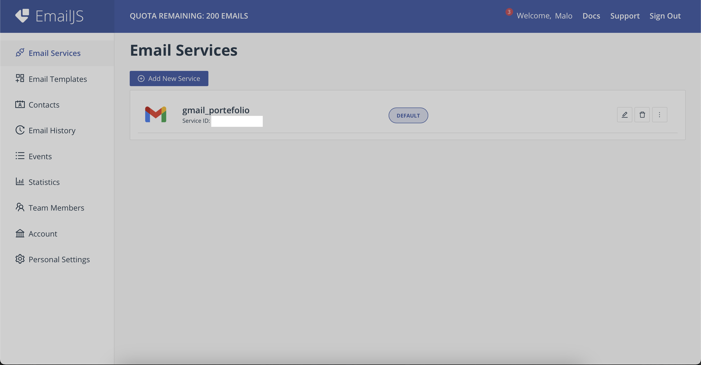

### EmailJS configuration

Go to [EmailJS website](https://www.emailjs.com). 

1. Sign in or create an account.

2. Add a new service



3. Choose one service (Gmail here)


4. Choose a service name, connect your Google account and click "Create service"


5. Create an email template using following docs:
- [Creating email templates](https://www.emailjs.com/docs/user-guide/creating-email-templates/)
- [React: Send email from contact form without server code](https://www.youtube.com/watch?v=bMq2riFCF90)

Once EmailJS is configured, you should get the 3 following IDs inside the .env file:
```
VUE_APP_EMAILJS_SERVICE_ID=your_service_id
VUE_APP_EMAILJS_TEMPLATE_ID=your_template_id 
VUE_APP_EMAILJS_USER_ID=your_user_id  