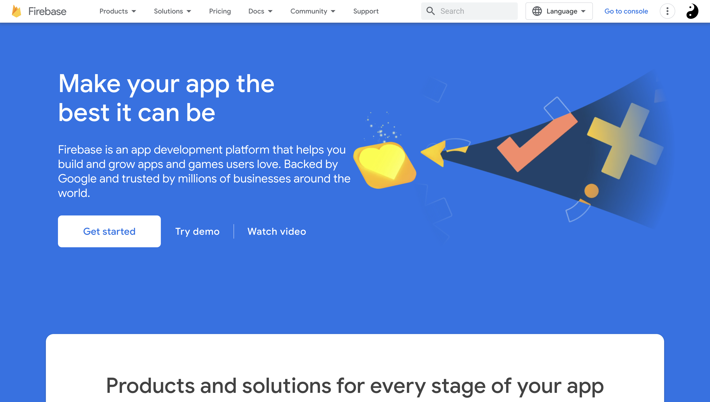

# Project setup

## Git clone

```
git clone https://github.com/MaloLM/custom-portfolio-website
```

> Some files may be case sensitive and get renamed by operating system, after clonning. Running the app will then return "Module not found" Error. 

## Software Requirement 
Download [Node.js](https://docs.npmjs.com/downloading-and-installing-node-js-and-npm). 

Using terminal inside project's root:
```
npm install
```

## prepare .env file configuration

Copy example.env to a new .env, at the project root: same directory than the README.md file.

The structure is as follows. Through this configuration tutorial, you will get every of those informations.
```
VUE_APP_API_KEY=
VUE_APP_AUTH_DOMAIN=
VUE_APP_PROJECT_ID=
VUE_APP_STORAGE_BUCKET=
VUE_APP_MESSAGING_SENDER_ID=
VUE_APP_APP_ID=
VUE_APP_DATABASE_URL=
VUE_APP_EMAILJS_SERVICE_ID=
VUE_APP_EMAILJS_TEMPLATE_ID=
VUE_APP_EMAILJS_USER_ID=
VUE_APP_RECAPTCHA_V3_PUBLIC_KEY=
VUE_APP_PAGE_TITLE=
```

## Create a Firebase project

Go to [Firebase website](https://firebase.google.com/)

Make sure to get connected with your Google account.
___
Click on "Get Start" or "Go to console" in top right corner:



Click on "+ Add project" to define a new firebase application project by following few steps.

___  

Then, choose to set a web app up and choose an app name. Do not select a Firebase hosting yet.


Then you will get a piece of code with initialization information.

Set the following ones inside the .env file:

```
VUE_APP_API_KEY=your_api_key
VUE_APP_AUTH_DOMAIN=your_auth_domain
VUE_APP_PROJECT_ID=your_project_id
VUE_APP_STORAGE_BUCKET=your_storage_bucket
VUE_APP_MESSAGING_SENDER_ID=your_messaging_senderId
VUE_APP_APP_ID=your_app_id
```
Finally, click to "go to console".
___

> You can configure your own domains. After deploying the app, you should be able to access it throught the defaults project domains

## Firebase authentication

Go to Firebase authentication menu and click "Get Started".


Choose the email/password sign in method.


Enable Email/password and let Email link disabled. Then save.

___

Go to Authentication/users submenu in order to create your admin user:


## Realtime database configuration

Go to Firebase Realtime Database menu and click "Create Database".

1. choose your location and "locked" mode

2. Go to "Rules" submenu and paste following rules with your own admin user UID:

```
{
  "rules": {
    "pages": {
      ".read": true,
      ".write": "auth.uid == 'your_admin_user_uid'"
    }
  }
}
```

> You can get your user UID in the Authentication menu (check Authentication part above)

___

3. Then get the content from import-me.json in project's root to get the database structure. Import JSON file from "..." options of the menu. This is a necessary step for the application to work properly.

4. From the data submenu of the realtime database menu, you should see a URL above the JSON section. Copy it and paste it inside the .env file. It typically looks something like: https://<your-project-id>.firebaseio.com or https://<your-project-id>.firebasedatabase.app

```
VUE_APP_DATABASE_URL=your_url
```

## Firebase storage configuration (for files storage)

Go to Firebase Storage menu and click "Get Started".

1. Choose 'production mode'.

2. Choose your storage location.

> After you set this location, you cannot change it later. This location setting will also be the default location for Cloud Firestore. In case of mistake, recreate a project

3. Click "Done".

4. Go to Firebase Storage / Rules. Edit rules so the read and write is possible (true):
```
rules_version = '2';

// Craft rules based on data in your Firestore database
// allow write: if firestore.get(
//    /databases/(default)/documents/users/$(request.auth.uid)).data.isAdmin;
service firebase.storage {
  match /b/{bucket}/o {
    match /{allPaths=**} {
      allow read, write: if true;
    }
  }
}
```
> Make sure the value stays at 'true'.

___

5. Once the storage is initiated, create the 2 following directories:


## EmailJS configuration

Email JS carries the "Get in touch" feature.
Steps are detailed in the [dedicated guide](./EMAIL_JS_SETUP.md).

## Cors policy configuration

This step is important for allowing the Vue client to access files from Cloud Storage.
If not configured, it will lead to CORS policy error.

Check the [dedicted part](./CORS_ISSUE.md) to configure CORS policy properly.

## Firebase project hosting

Once each of the above parts are correctly configured, you can deploy the app with the following steps.
Your .env file should be now full.

### Hosting

Go to Firebase Hosting menu and click "Get Started".

1. Run those commands from your app's root directory: 

```
npm install firebase-tools
npm install firebase@9
```

2. Sign in to Google 
```
firebase login
```
> if firebase is not recognized as a command, install the 2 libraries globally: `npm install -g firebase-tools firebase@9`

3. Initiate your project 
```
firebase init
```

This command will ask for configuration questions:

=== Project Setup

> Q: Which Firebase features do you want to set up for this directory? Press Space to select features, then Enter to confirm your choices.

- Realtime Database: Configure a security rules file for Realtime Database and (optionally) provision default instance
- Hosting: Configure files for Firebase Hosting and (optionally) set up GitHub Action deploys
- Storage: Configure a security rules file for Cloud Storage


> Q: Please select an option: Use an existing project

Select a default Firebase project for this directory: your_firebase_project_name among selection

=== Database Setup

> Q: What file should be used for Realtime Database Security Rules? database.rules.json

=== Hosting Setup

> Q: What do you want to use as your public directory ? dist

> Q: Configure as a single-page app (rewrite all urls to /index.html) ? Yes

> Q: Set up automatic builds and deploys with GitHub ? No

=== Storage Setup

> Q: What file should be used for Storage Rules? storage.rules

4. Compiles and hot-reloads to check the app is working locally.

```
npm run serve
```
> If the project is running properly locally, then you can proceed to app build. 

5. App build

App build will store the distribution version inside the dist directory.

```
npm run build
```

6. Deploy
This step will get the built version from the dist directory to get it running at Firebase hosting.
```
firebase deploy
```


> During deploy, Firebase CLI may ask you a question about IAM Role, answer by __no__, or __yes__ if you know what you are doing. 


> If deploy is succesfull, you should see a production version of your app currently working and accessible from the displayed URLs

# Going further

Check the [dedicated guide](./GOING_FURTHER.md).
- Associate a domain name to your website
- Possibble issues you can face

# Thank you for choosing this project ❤️

If you like my work, please share it or leave a star on GitHub 
