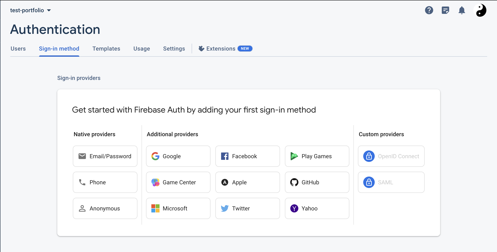
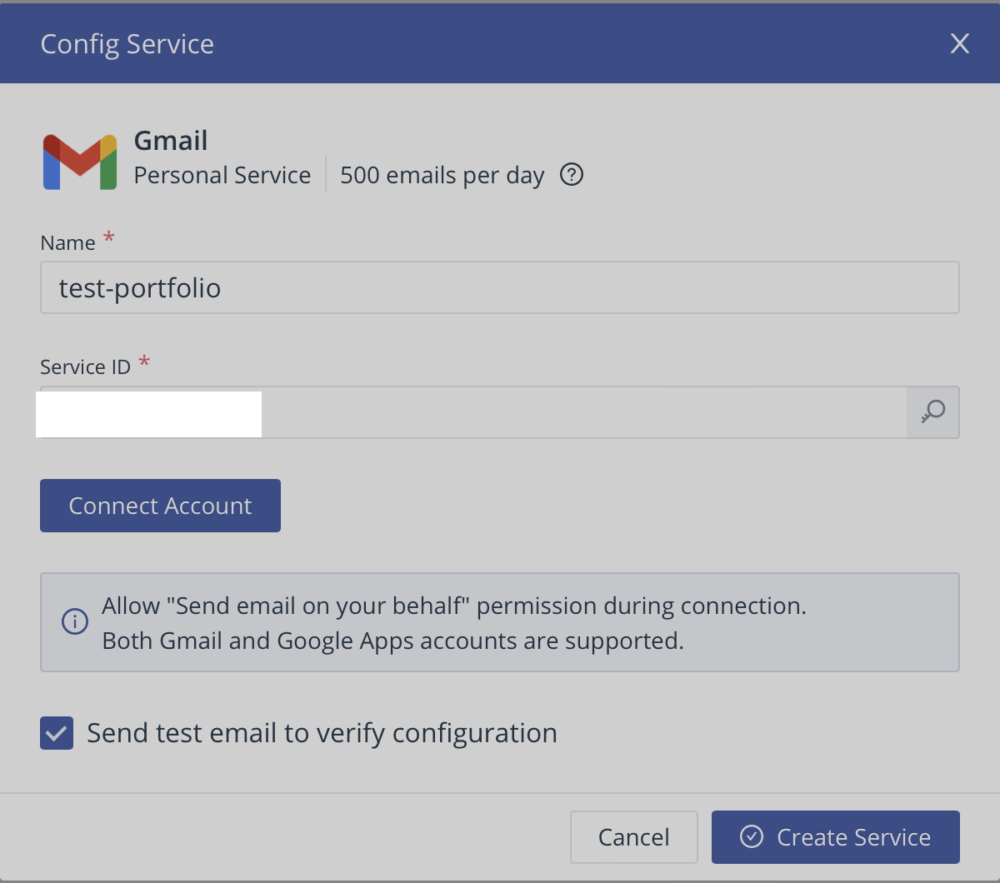
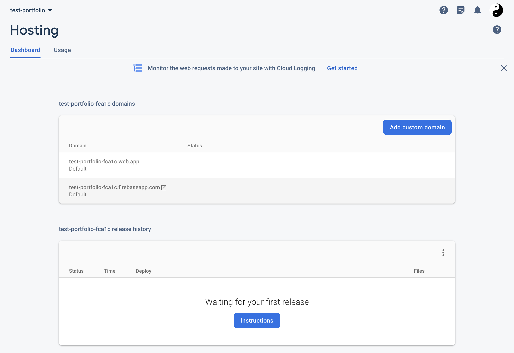
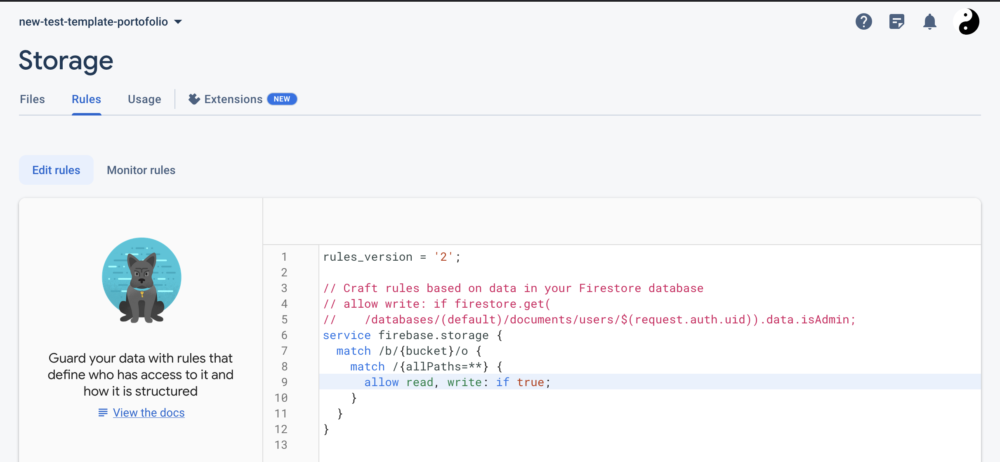

## Project setup

### Git clone

```
git clone project-link
```

> Some files may be case sensitive and get renamed by operating system, after clonning. Running the app will then return "Module not found" Error. 

### Software Requirement 
Using terminal inside project's root:
```
npm install
```

### prepare .env file configuration

Rename example.env to .env, at the project root: same directory than this README.md.

The structure is the following one. Through this configuration tutorial, you will get every of those informations.
```
VUE_APP_API_KEY=
VUE_APP_AUTH_DOMAIN=
VUE_APP_PROJECT_ID=
VUE_APP_STORAGE_BUCKET=
VUE_APP_MESSAGING_SENDER_ID=
VUE_APP_APP_ID=
VUE_APP_DATABASE_URL=
VUE_APP_EMAILJS_SERVICE_ID=
VUE_APP_EMAILJS_TEMPLATE_ID=
VUE_APP_EMAILJS_USER_ID=
VUE_APP_RECAPTCHA_V3_PUBLIC_KEY=
```

### Create a Firebase project

Go to [Firebase website](https://firebase.google.com/)

Make sure to get connected with your Google account.
___
Click on "Get Start" or "Go to console" in top right corner:


Click on "+ Add project" to define a new firebase application project by following few steps.

___  

Then, choose to set a web app up and choose an app name. Do not select a Firebase hosting yet.


Then you will get a piece of code with initialization information. Set the following one inside the .env file:

```
VUE_APP_API_KEY=your_apiKey
VUE_APP_AUTH_DOMAIN=your_authDomain
VUE_APP_PROJECT_ID=your_projectId
VUE_APP_STORAGE_BUCKET=your_storageBucket
VUE_APP_MESSAGING_SENDER_ID=your_messagingSenderId
VUE_APP_APP_ID=your_appId
```
Finally, click to "go to console".
___

> You can configure your own domains. After deploying the app, you should be able to access it throught the defaults project domains

### Firebase authentication

Go to Firebase authentication menu and click "Get Started".



Choose the email/password sign in method.


Enable Email/password and let Email link disabled. Save.

___

Go to Authentication/users submenu in order to create your admin user:


### Realtime database configuration

Go to Firebase Realtime Database menu and click "Create Database".

1. choose your location and 'locked' mode

2. Go to "Rules" submenu and paste following rules:

```
{
  "rules": {
    "pages": {
      ".read": true,
      ".write": "auth.uid == 'your_admin_user_uid'"
    }
  }
}
```

> You can get your user UID in the Authentication menu (check Authentication part above)

___

3. Then get the content from import-me.json in project's root to get the database structure. Import JSON file from "..." options of the menu. 

4. From the data submenu of the realtime database menu, you should see a URL above the JSON section. Copy it and paste it inside the .env file. It typically looks something like: https://<your-project-id>.firebaseio.com

```
VUE_APP_DATABASE_URL=your_url
```

### Firebase storage configuration (for files storage)

Go to Firebase Storage menu and click "Get Started".

1. choose 'production mode'.

2. choose your storage location (cannot be changed anymore, in case of error, recreate a project).

> After you set this location, you cannot change it later. This location setting will also be the default location for Cloud Firestore. 

3. Click "Done"

4. Go to Firebase Storage / Rules. Edit rules so the read and write is possible (true):
```
rules_version = '2';

// Craft rules based on data in your Firestore database
// allow write: if firestore.get(
//    /databases/(default)/documents/users/$(request.auth.uid)).data.isAdmin;
service firebase.storage {
  match /b/{bucket}/o {
    match /{allPaths=**} {
      allow read, write: if true;
    }
  }
}
```
> Make sure the value stay 'true'.

___

5. Once the storage is initiated, create the 2 following directories:


### EmailJS configuration

Go to [EmailJS website](https://www.emailjs.com). 

1. Sign in or create an account.

2.Add a new service


3. Choose one service (Gmail here)


4. Choose a service name, connect your Google account and click "Create service"



5. Create an email template using following docs:
- [Creating email templates](https://www.emailjs.com/docs/user-guide/creating-email-templates/)
- [React: Send email from contact form without server code](https://www.youtube.com/watch?v=bMq2riFCF90)

Once EmailJS is configured, you should get the 3 following IDs inside the .env file:
```
VUE_APP_EMAILJS_SERVICE_ID=your_service_id
VUE_APP_EMAILJS_TEMPLATE_ID=your_template_id 
VUE_APP_EMAILJS_USER_ID=your_user_id     
```
### CV upload

You can make a CV downloadable. 

Just follow the following steps:

1. get your CV prepared

2. Go to Firebase Storage: cv / 

3. Upload your file to cv/ directory. Alternatively, you can upload your PDF CV from the admin pannel of the app (when deployed)

4. Once file is uploaded, get the generated file url from the file description and paste it inside the .env file:
```
VUE_APP_CV_LINK=your_firebase_stroage_uploaded_cv_url
```

### Firebase project hosting

Once every above parts are correctly configured, you can deploy the app with the following steps.
Your .env file should be full.

#### Hosting

Go to Firebase Hosting menu and click "Get Started".

1. Run those commands from your app's root directory: 

```
npm install firebase-tools
npm install firebase@9
```

2. Sign in to Google 
```
firebase login
```

3. Initiate your project 
```
firebase init
```

This command will ask for configuration questions:
=== Project Setup

Which Firebase features do you want to set up for this directory? Press Space to select features, then Enter to confirm your choices.

- Realtime Database: Configure a security rules file for Realtime Database and (optionally) provision default instance
- Hosting: Configure files for Firebase Hosting and (optionally) set up GitHub Action deploys
- Storage: Configure a security rules file for Cloud Storage


Please select an option: Use an existing project

Select a default Firebase project for this directory: your_firebase_project_name among selection

=== Database Setup

What file should be used for Realtime Database Security Rules? database.rules.json

=== Hosting Setup

What do you want to use as your public directory ? dist

Configure as a single-page app (rewrite all urls to /index.html) ? Yes

Set up automatic builds and deploys with GitHub ? No

=== Storage Setup

? What file should be used for Storage Rules? storage.rules

4. Compiles and hot-reloads to check the app is working locally
If the project is running properly locally, then you can proceed to app build. 

```
npm run serve
```

5. App build
App build will store the distribution version inside the dist directory.

```
npm run build
```

6. Deploy
```
firebase deploy
```


> During deploy, Firebase CLI may ask you a question about IAM Role, answer by no or by yes if you know what you are doing. 



> If deploy is succesfull, you should see a production version of your app currently working and accessible from the displayed URLs


## Going further

> This part is case sensitive and you should own a proper domain name

### Associate app to a owned domain name

Go to Firebase Hosting menu and click "Add custom domain". A new menu appears:


Then write your domain.

You can follow this documentation to go through this step:
- [[Official documentation] Connect a custom domain](https://firebase.google.com/docs/hosting/custom-domain?hl=fr)
- [[Tutorial] - How to Setup Custom Domain for Google Firebase Website](https://www.youtube.com/watch?v=IBMNvoJcy-k)

# Debug, some issues you can meet

## Storage read & write

If you can update the database with new files (pictures, CV), encountering 401:403 messages: make sure the storage read & write are enabled. To do so, go to Firebase Storage / rules and switch 'false' to 'true'.



> you should edit storage rules from your storage.rules file, generated after project configuration. By default, read & write are disabled.

## Already configured project

Encountering following message while doing $ firebase init:
> You are initializing within an existing Firebase project directory

remove those files:
- .firebaserc
- firebase.json

process again $ firebase init 

## import error

### files renamed when pushing

Some files may be renamed when pulling project because of case sensitive OS rules. When running the app locally, it may returns errors because of this.

### Firebase version
if Firebase imports are preventing the app to run locally, check the Firebase npm package version.
```
import firebase from 'firebase/compat/app';
```

V8 of the package is not appropriate then move to the 9th version:
```
npm install firebase@9
```
