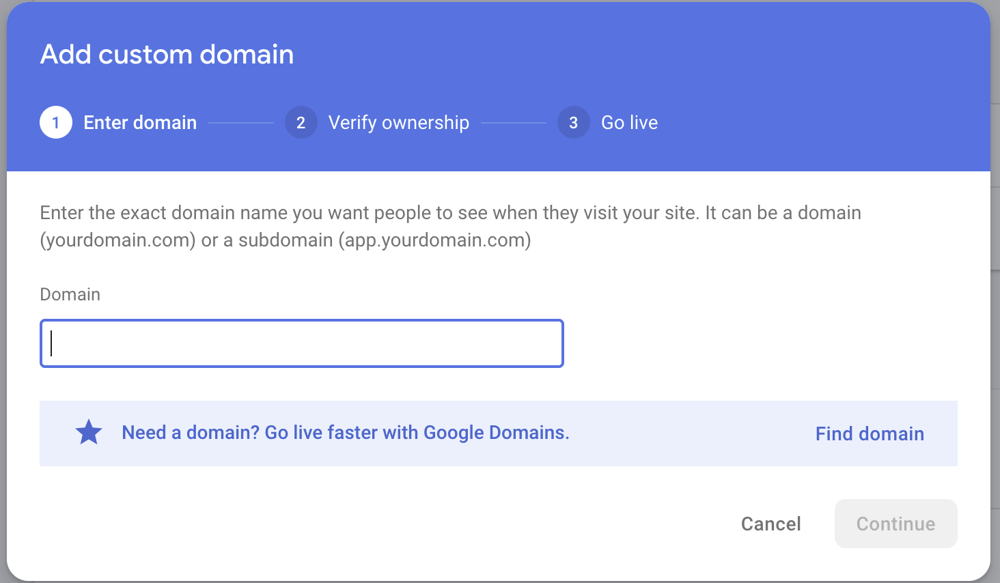
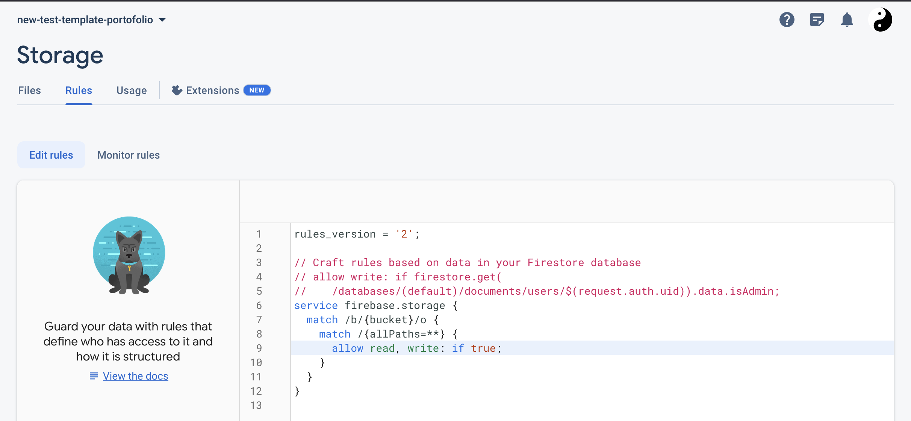

# Going further

> This part is case sensitive and you should own a proper domain name

## Associate app to a owned domain name

Go to Firebase Hosting menu and click "Add custom domain". A new menu appears:



Then write your domain.

You can follow this documentation to go through this step:
- [[Official documentation] Connect a custom domain](https://firebase.google.com/docs/hosting/custom-domain?hl=fr)
- [[Tutorial] - How to Setup Custom Domain for Google Firebase Website](https://www.youtube.com/watch?v=IBMNvoJcy-k)

# Debug, some issues you can meet

## Storage read & write

If you can not update the database with new files (pictures, CV), encountering 401:403 messages: make sure the storage read & write are enabled. 
To do so, go to Firebase Storage / rules and switch 'false' to 'true'.



> you should edit storage rules from your storage.rules file, generated after project configuration. By default, read & write are disabled.

## Already configured project

Encountering following message while doing $ firebase init:
> You are initializing within an existing Firebase project directory

remove those files:
- .firebaserc
- firebase.json

process again $ firebase init 

## import errors

### files renamed when pushing

Some files may be renamed when pulling project because of case sensitive OS rules. 

When running the app locally, it may returns errors because of this.

### Firebase version

if Firebase imports are preventing the app to run locally, check the Firebase npm package version.
```
import firebase from 'firebase/compat/app';
```

V8 of the package is not appropriate then move to the 9th version:
```
npm install firebase@9
```
